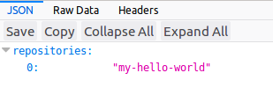
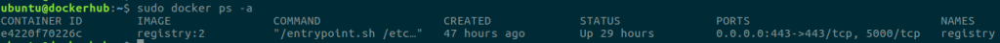

# Docker Rate Limit'e karşı Güvenli Local Docker Registry Kurulumu

**Docker registry docker images**’larının depolandığı sistemdir. **Docker images**’larını **pull** ile çekip, **push** ile de gönderip paylaştığımız sistemdir. Hali hazırda **docker** resmi olarak [https://hub.docker.com/](https://hub.docker.com/) dan binlerce özel yada genel, kullanıma açtığı **images**’lar bulunmaktadır. Bizlerde bu sistemi kullanmaktayız. Özellikle **docker**'ın **image**'lere **pull rate limit**'i koymasıyla [https://docs.docker.com/docker-hub/download-rate-limit/](https://docs.docker.com/docker-hub/download-rate-limit/) **yerel registry** kullanımı daha da elzem olmuştur.

**Docker hub** gibi sadece yerel ağınızda kullanıma açmak isteyebileceğiniz bu sistemi aşağıdaki yöntem ile kurup kullanabilirsiniz.

**Registry** için biz ubuntu kullanacağız ve **docker** kurulumun yapılmış olduğunu farz ederek **registry** kurulumuna geçiyoruz.

Örnek **domain** olarak “**docker.fatlan.com**” kullanılmıştır.

**Docker image**'ları aşağıdaki gibidir;

- https://hub.docker.com/_/registry
- https://hub.docker.com/r/klausmeyer/docker-registry-browser/

Kuruluma geçmeden önce güvenli kurulum olduğu için **ssl** sertifikalarınız(**domain.crt**, **domain.key**) mevcut olmalıdır. Bu sertifika **authority confirmed** olabilir yada **self sign** olabilir. Burada önemli olan kısım **domain.crt** dosyasının içinde ilk olarak domain sertifika **key**’i akabinde kök sertifika **key**’i olmalıdır. Yoksa **registry**’e **images push** ettiğinizde “**x509: certificate signed by unknown authority**” hatası alırsınız.

Sertifikalarınızı “**/home/fatlan/certs**” klasörünün altına taşıyın.

~~~
sudo mkdir /home/fatlan/certs
~~~

Ardından “**mkdir**” komutu ile “**/mnt/registry-repo**” klasörünü oluşturun. Biz **registry** için **images store** olarak bu directory kullanacağız. Sizler bu kısımda “**/mnt/registry-repo**” dizini farklı bir **disk** yada **partition** olarak seçip, **mount** edip daha geniş bir alana olarak kullanabilirsiniz.

~~~
sudo mkdir /mnt/registry-repo
~~~

Ardından aşağıdaki komutla **docker registry**’i ve **frontend(80)** kuralım.

~~~
docker run -d --restart=always --name registry -v /home/fatlan/certs:/certs -v /mnt/registry-repo:/var/lib/registry -e REGISTRY_HTTP_ADDR=0.0.0.0:443 -e REGISTRY_HTTP_TLS_CERTIFICATE=/certs/domain.crt -e REGISTRY_HTTP_TLS_KEY=/certs/domain.key -p 443:443 registry:2

docker run -d -p 80:8080 --restart=always --name registry-browser -e DOCKER_REGISTRY_URL=https://docker.fatlan.com klausmeyer/docker-registry-browser
~~~

Registry container’ımızın çalıştığını “**sudo docker ps -a**” komutu ile kontrol edelim.

Şimdi kurulumu doğrulamak için **pull** ve **push** yöntemlerini de dahil ederek test edelim. Ayrıca **https://docker.fatlan.com/v2/_catalog** ve **http://docker.fatlan.com** adresinden de kontrol edebilirsiniz, tabi siz kendi belirlediğiniz **domain name**‘i girmelisiniz.

İlk önce **hello-world images**’ını **docker hub**’tan **pull** edelim.

~~~
sudo docker pull hello-world
~~~

Ardından bize özel olması için **tag** atayalım.

~~~
sudo docker tag hello-world docker.fatlan.com/my-hello-world
~~~

Şimdi **yerel registry**’ımıza **push** ile gönderelim.

~~~
sudo docker push docker.fatlan.com/my-hello-world
~~~

Son olarak bu **images**’ımızı yani kendi **yerel registry**’ımızdan **pull** edelim ve bitirelim.

~~~
sudo docker pull docker.fatlan.com:443/my-hello-world
~~~